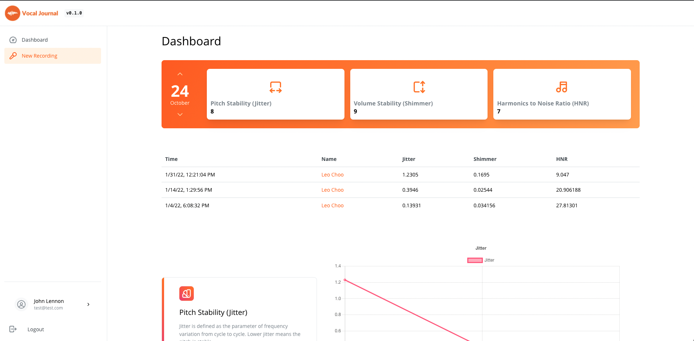

<!--
*** Thanks for checking out the Best-README-Template. If you have a suggestion
*** that would make this better, please fork the repo and create a pull request
*** or simply open an issue with the tag "enhancement".
*** Don't forget to give the project a star!
*** Thanks again! Now go create something AMAZING! :D
-->

<!-- PROJECT SHIELDS -->
<!--
*** I'm using markdown "reference style" links for readability.
*** Reference links are enclosed in brackets [ ] instead of parentheses ( ).
*** See the bottom of this document for the declaration of the reference variables
*** for contributors-url, forks-url, etc. This is an optional, concise syntax you may use.
*** https://www.markdownguide.org/basic-syntax/#reference-style-links
-->

<!-- PROJECT LOGO -->
 

  

  

     
    <a href="https://react-voice.web.app">Click to view demo!  
    デモはこちら！</a>
     
  

<!-- TABLE OF CONTENTS -->

  
Table of Contents

  <ol>
    <li>
      <a href="#about-the-project">About The Project</a>
      <ul>
        <li><a href="#built-with">Built With</a></li>
      </ul>
    </li>
    <li>
      <a href="#getting-started">Getting Started</a>
      <ul>
        <li><a href="#prerequisites">Prerequisites</a></li>
        <li><a href="#installation">Installation</a></li>
      </ul>
    </li>
    <li><a href="#usage">Usage</a></li>
    <li><a href="#roadmap">Roadmap</a></li>
    <li><a href="#contributing">Contributing</a></li>
    <li><a href="#license">License</a></li>
    <li><a href="#contact">Contact</a></li>
    <li><a href="#acknowledgments">Acknowledgments</a></li>
  </ol>

<!-- ABOUT THE PROJECT -->

## About The Project

  Vocal Journal is a journaling app that's designed to improve your vocal performance. The app allows you to record, tag, organize, and analyze your voice recordings in order to help you perform better in auditions and performances.

(<a href="#top">back to top</a>)

### Built With

- [React.js](https://reactjs.org/)
- [TypeScript](https://www.typescriptlang.org/)
- [Mantine](https://mantine.dev/) | [Mantine UI](https://ui.mantine.dev/) 
- [Firebase](https://firebase.google.com/)
- [React-Router](https://reacttraining.com/react-router/)
- [Redux Toolkit](https://redux-toolkit.js.org/)

(<a href="#top">back to top</a>)

<!-- USAGE EXAMPLES -->

## Usage

Upload your voice in "New Recording" and start tagging your voice. Once you upload your voice, you can view your recordings and analysis in Dashboard.

(<a href="#top">back to top</a>)

<!-- ROADMAP -->

## Roadmap
- [x] Log in
- [x] Dashboard
  - [x] Jitter
  - [x] Shimmer
  - [x] HNR
- [x] New Recording
  - [ ] Record voice
  - [ ] Upload to Firebase

See the [open issues](https://github.com/github_username/repo_name/issues) for a full list of proposed features (and known issues).

(<a href="#top">back to top</a>)

<!-- CONTRIBUTING -->

<!-- LICENSE -->

<!-- CONTACT -->

(<a href="#top">back to top</a>)

<!-- ACKNOWLEDGMENTS -->

## Acknowledgments

- [Parselmouth – Praat in Python](https://parselmouth.readthedocs.io/en/stable/)
- [Praat](https://www.fon.hum.uva.nl/praat/)
- [SFC Neuromusic Lab](https://neuromusic.sfc.keio.ac.jp/?lang=en)

(<a href="#top">back to top</a>)

<!-- MARKDOWN LINKS & IMAGES -->
<!-- https://www.markdownguide.org/basic-syntax/#reference-style-links -->

[contributors-shield]: https://img.shields.io/github/contributors/github_username/repo_name.svg?style=for-the-badge
[contributors-url]: https://github.com/github_username/repo_name/graphs/contributors
[forks-shield]: https://img.shields.io/github/forks/github_username/repo_name.svg?style=for-the-badge
[forks-url]: https://github.com/github_username/repo_name/network/members
[stars-shield]: https://img.shields.io/github/stars/github_username/repo_name.svg?style=for-the-badge
[stars-url]: https://github.com/github_username/repo_name/stargazers
[issues-shield]: https://img.shields.io/github/issues/github_username/repo_name.svg?style=for-the-badge
[issues-url]: https://github.com/github_username/repo_name/issues
[license-shield]: https://img.shields.io/github/license/github_username/repo_name.svg?style=for-the-badge
[license-url]: https://github.com/github_username/repo_name/blob/master/LICENSE.txt
[linkedin-shield]: https://img.shields.io/badge/-LinkedIn-black.svg?style=for-the-badge&logo=linkedin&colorB=555
[linkedin-url]: https://linkedin.com/in/linkedin_username
[product-screenshot]: images/screenshot.png
